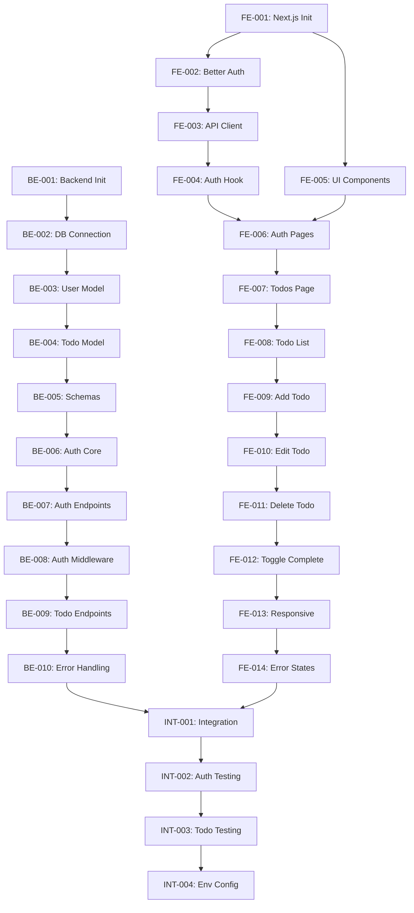

# Phase II: Atomic Implementation Tasks

**Project**: Evolution of Todo  
**Phase**: II - Full-Stack Web Application  
**Status**: Ready for Implementation  
**Last Updated**: 2026-01-11

---

## Task Overview

This document breaks down the Phase II technical plan into **atomic, sequential implementation tasks**. Each task is small, verifiable, and has clear preconditions and outcomes.

**Total Tasks**: 25  
**Categories**: Backend (10), Frontend (11), Integration (4)

---

## Backend Tasks

### TASK-BE-001: Initialize Backend Project Structure

**Description**: Set up FastAPI project with organized directory structure and core dependencies.

**Preconditions**:
- Python 3.11+ installed
- Phase II technical plan approved

**Steps**:
1. Create `backend/` directory
2. Create virtual environment
3. Create `requirements.txt` with dependencies:
   - `fastapi`
   - `uvicorn[standard]`
   - `sqlmodel`
   - `psycopg2-binary` (PostgreSQL driver)
   - `pydantic[email]`
   - `python-jose[cryptography]` (JWT tokens)
   - `passlib[bcrypt]` (password hashing)
   - `python-multipart`
4. Create directory structure:
   ```
   backend/
   ├── app/
   │   ├── __init__.py
   │   ├── main.py
   │   ├── config.py
   │   ├── database.py
   │   ├── models/
   │   ├── schemas/
   │   ├── api/
   │   └── core/
   └── requirements.txt
   ```
5. Create basic `main.py` with FastAPI app initialization
6. Test server starts: `uvicorn app.main:app --reload`

**Expected Outcome**:
- Backend project structure created
- Dependencies installed
- FastAPI server runs successfully on `http://localhost:8000`
- API docs accessible at `http://localhost:8000/docs`

**Artifacts Created**:
- `backend/requirements.txt`
- `backend/app/main.py`
- `backend/app/__init__.py`
- `backend/app/config.py`
- `backend/app/database.py`
- Directory structure for models, schemas, api, core

**References**:
- Technical Plan: Section 2.2 (Project Structure)
- Technical Plan: Section 5.3 (Local Development Setup)

---

### TASK-BE-002: Configure Neon PostgreSQL Connection

**Description**: Set up database connection to Neon Serverless PostgreSQL using SQLModel.

**Preconditions**:
- TASK-BE-001 completed
- Neon account created
- Neon database provisioned

**Steps**:
1. Obtain Neon connection string from dashboard
2. Create `.env.example` with template variables
3. Create `.env` with actual credentials (gitignored)
4. Install `python-dotenv` for environment variable loading
5. Update `config.py` to load `DATABASE_URL` from environment
6. Update `database.py` to create SQLModel engine:
   ```python
   from sqlmodel import create_engine, Session
   engine = create_engine(DATABASE_URL, echo=True)
   ```
7. Create `get_session()` dependency for database sessions
8. Test connection by running a simple query

**Expected Outcome**:
- Database connection configured
- Environment variables loaded
- Database session dependency available
- Connection test successful

**Artifacts Created/Modified**:
- `backend/.env.example`
- `backend/.env` (gitignored)
- `backend/app/config.py` (updated)
- `backend/app/database.py` (updated)
- `backend/requirements.txt` (add `python-dotenv`)

**References**:
- Technical Plan: Section 2.5 (Data Persistence)
- Technical Plan: Section 5.3 (Local Development Setup)

---

### TASK-BE-003: Create User Data Model

**Description**: Define SQLModel User model for database persistence.

**Preconditions**:
- TASK-BE-002 completed

**Steps**:
1. Create `app/models/__init__.py`
2. Create `app/models/user.py`
3. Define `User` class inheriting from `SQLModel` with `table=True`:
   - `id: int | None` (primary key)
   - `email: str` (unique, indexed, max 255 chars)
   - `password_hash: str` (max 255 chars)
   - `created_at: datetime` (auto-generated)
   - `updated_at: datetime` (auto-updated)
4. Add relationship field for todos (will be populated in TASK-BE-004)
5. Import User model in `database.py`
6. Create table in database: `SQLModel.metadata.create_all(engine)`
7. Verify table created in Neon dashboard

**Expected Outcome**:
- User model defined
- `users` table created in Neon database
- Table schema matches specification

**Artifacts Created**:
- `backend/app/models/__init__.py`
- `backend/app/models/user.py`

**References**:
- Specification: Section 3.1 (User Model)
- Technical Plan: Section 4.1 (User Data Model)

---

### TASK-BE-004: Create Todo Data Model

**Description**: Define SQLModel Todo model with foreign key relationship to User.

**Preconditions**:
- TASK-BE-003 completed

**Steps**:
1. Create `app/models/todo.py`
2. Define `Todo` class inheriting from `SQLModel` with `table=True`:
   - `id: int | None` (primary key)
   - `user_id: int` (foreign key to users.id, indexed)
   - `title: str` (max 200 chars)
   - `description: str | None` (max 1000 chars, nullable)
   - `completed: bool` (default False)
   - `created_at: datetime` (auto-generated)
   - `updated_at: datetime` (auto-updated)
3. Add `Relationship` to User model
4. Update User model to include `todos: list["Todo"]` relationship
5. Create table in database
6. Verify foreign key constraint in Neon dashboard
7. Test cascade delete behavior

**Expected Outcome**:
- Todo model defined
- `todos` table created in Neon database
- Foreign key relationship established
- Cascade delete configured

**Artifacts Created/Modified**:
- `backend/app/models/todo.py`
- `backend/app/models/user.py` (updated with relationship)

**References**:
- Specification: Section 3.2 (Todo Model)
- Technical Plan: Section 4.2 (Todo Data Model)
- Technical Plan: Section 4.3 (Relationship)

---

### TASK-BE-005: Create Pydantic Schemas

**Description**: Define request/response schemas for API endpoints.

**Preconditions**:
- TASK-BE-004 completed

**Steps**:
1. Create `app/schemas/__init__.py`
2. Create `app/schemas/auth.py` with:
   - `UserSignup` (email, password)
   - `UserSignin` (email, password)
   - `UserResponse` (id, email, created_at)
   - `Token` (access_token, token_type)
3. Create `app/schemas/todo.py` with:
   - `TodoCreate` (title, description optional)
   - `TodoUpdate` (title optional, description optional, completed optional)
   - `TodoResponse` (id, user_id, title, description, completed, created_at, updated_at)
4. Add validation rules (e.g., email format, title length)

**Expected Outcome**:
- Request/response schemas defined
- Validation rules implemented
- Schemas ready for use in API endpoints

**Artifacts Created**:
- `backend/app/schemas/__init__.py`
- `backend/app/schemas/auth.py`
- `backend/app/schemas/todo.py`

**References**:
- Specification: Section 2 (User Stories)
- Technical Plan: Section 2.2 (API Routing)

---

### TASK-BE-006: Implement Authentication Core

**Description**: Implement password hashing, JWT token generation, and validation.

**Preconditions**:
- TASK-BE-005 completed

**Steps**:
1. Create `app/core/__init__.py`
2. Create `app/core/auth.py` with:
   - `hash_password(password: str) -> str` using bcrypt
   - `verify_password(plain: str, hashed: str) -> bool`
   - `create_access_token(data: dict) -> str` (JWT)
   - `decode_access_token(token: str) -> dict`
3. Add `SECRET_KEY` to config (generate random key)
4. Configure JWT expiration (24 hours)
5. Test password hashing and verification
6. Test token creation and decoding

**Expected Outcome**:
- Password hashing functions working
- JWT token generation working
- Token validation working
- Secret key configured

**Artifacts Created/Modified**:
- `backend/app/core/__init__.py`
- `backend/app/core/auth.py`
- `backend/app/config.py` (add SECRET_KEY)

**References**:
- Technical Plan: Section 2.4 (Authentication Integration)
- Technical Plan: Section 5.2 (Auth Token/Session Flow)

---

### TASK-BE-007: Implement Authentication Endpoints

**Description**: Create signup and signin API endpoints.

**Preconditions**:
- TASK-BE-006 completed

**Steps**:
1. Create `app/api/__init__.py`
2. Create `app/api/auth.py`
3. Implement `POST /api/auth/signup`:
   - Validate email not already registered
   - Hash password
   - Create user in database
   - Return user data (without password)
4. Implement `POST /api/auth/signin`:
   - Query user by email
   - Verify password
   - Generate JWT token
   - Return token and user data
5. Implement `GET /api/auth/me`:
   - Validate token
   - Return current user data
6. Register auth router in `main.py`
7. Test endpoints with API client (Postman/curl)

**Expected Outcome**:
- Signup endpoint working
- Signin endpoint working
- User data persisted in database
- JWT tokens generated correctly
- Error cases handled (duplicate email, invalid credentials)

**Artifacts Created/Modified**:
- `backend/app/api/__init__.py`
- `backend/app/api/auth.py`
- `backend/app/main.py` (register router)

**References**:
- Specification: Section 2.1 (Authentication User Stories)
- Technical Plan: Section 2.3 (API Routing)

---

### TASK-BE-008: Implement Authentication Middleware

**Description**: Create dependency for protecting routes and extracting current user.

**Preconditions**:
- TASK-BE-007 completed

**Steps**:
1. Create `app/api/deps.py`
2. Implement `get_current_user()` dependency:
   - Extract token from `Authorization` header
   - Decode and validate token
   - Query user from database
   - Return user or raise 401 Unauthorized
3. Implement `get_db()` dependency for database sessions
4. Test dependency with protected endpoint
5. Test error cases (missing token, invalid token, expired token)

**Expected Outcome**:
- `get_current_user()` dependency working
- Protected routes can use dependency injection
- Unauthorized requests rejected with 401
- Database session dependency available

**Artifacts Created**:
- `backend/app/api/deps.py`

**References**:
- Technical Plan: Section 2.4 (Authentication Integration)
- Technical Plan: Section 2.6 (User-to-Todo Data Ownership)

---

### TASK-BE-009: Implement Todo CRUD Endpoints

**Description**: Create all todo management API endpoints.

**Preconditions**:
- TASK-BE-008 completed

**Steps**:
1. Create `app/api/todos.py`
2. Implement `GET /api/todos`:
   - Require authentication
   - Query todos where `user_id == current_user.id`
   - Return list of todos
3. Implement `POST /api/todos`:
   - Require authentication
   - Validate request body
   - Create todo with `user_id = current_user.id`
   - Return created todo
4. Implement `GET /api/todos/{id}`:
   - Require authentication
   - Query todo by id
   - Verify ownership
   - Return todo or 403/404
5. Implement `PUT /api/todos/{id}`:
   - Require authentication
   - Verify ownership
   - Update todo fields
   - Return updated todo
6. Implement `PATCH /api/todos/{id}`:
   - Same as PUT but partial update
7. Implement `DELETE /api/todos/{id}`:
   - Require authentication
   - Verify ownership
   - Delete todo
   - Return 204 No Content
8. Register todos router in `main.py`
9. Test all endpoints with API client

**Expected Outcome**:
- All CRUD endpoints working
- User ownership enforced
- Proper HTTP status codes returned
- Error cases handled

**Artifacts Created/Modified**:
- `backend/app/api/todos.py`
- `backend/app/main.py` (register router)

**References**:
- Specification: Section 2.2 (Backend API User Stories)
- Technical Plan: Section 2.3 (API Routing)
- Technical Plan: Section 2.6 (User-to-Todo Data Ownership)

---

### TASK-BE-010: Implement Backend Error Handling

**Description**: Add comprehensive error handling and CORS configuration.

**Preconditions**:
- TASK-BE-009 completed

**Steps**:
1. Create `app/core/exceptions.py` with custom exception classes:
   - `AuthenticationError`
   - `AuthorizationError`
   - `NotFoundError`
   - `ValidationError`
2. Add exception handlers in `main.py`:
   - Handle custom exceptions
   - Handle SQLAlchemy errors
   - Handle Pydantic validation errors
   - Return consistent error response format
3. Configure CORS middleware in `main.py`:
   - Allow frontend origin (`http://localhost:3000`)
   - Allow credentials
   - Allow all methods and headers
4. Test error responses for all error cases
5. Test CORS with frontend origin

**Expected Outcome**:
- Consistent error response format
- All error cases handled gracefully
- CORS configured for local development
- Error messages user-friendly

**Artifacts Created/Modified**:
- `backend/app/core/exceptions.py`
- `backend/app/main.py` (add exception handlers and CORS)

**References**:
- Specification: Section 7 (Error Handling Scenarios)
- Technical Plan: Section 2.7 (Error Handling)
- Technical Plan: Section 5.3 (CORS Configuration)

---

## Frontend Tasks

### TASK-FE-001: Initialize Next.js Project

**Description**: Set up Next.js project with TypeScript and organized structure.

**Preconditions**:
- Node.js 18+ installed
- Phase II technical plan approved

**Steps**:
1. Create `frontend/` directory
2. Initialize Next.js project with TypeScript:
   ```bash
   npx create-next-app@latest frontend --typescript --app --no-tailwind
   ```
3. Create directory structure:
   ```
   frontend/
   ├── src/
   │   ├── app/
   │   ├── components/
   │   ├── lib/
   │   └── hooks/
   ├── public/
   └── package.json
   ```
4. Install additional dependencies:
   - `better-auth` (authentication)
5. Configure `tsconfig.json` for path aliases
6. Test development server: `npm run dev`
7. Verify app runs on `http://localhost:3000`

**Expected Outcome**:
- Next.js project initialized
- TypeScript configured
- Directory structure created
- Development server running

**Artifacts Created**:
- `frontend/package.json`
- `frontend/tsconfig.json`
- `frontend/next.config.js`
- `frontend/src/app/layout.tsx`
- `frontend/src/app/page.tsx`
- Directory structure for components, lib, hooks

**References**:
- Technical Plan: Section 3.1 (Next.js Application Structure)
- Technical Plan: Section 5.3 (Local Development Setup)

---

### TASK-FE-002: Configure Better Auth

**Description**: Set up Better Auth for authentication state management.

**Preconditions**:
- TASK-FE-001 completed
- TASK-BE-007 completed (backend auth endpoints available)

**Steps**:
1. Create `src/lib/auth.ts`
2. Configure Better Auth client:
   - Set API base URL (`http://localhost:8000`)
   - Configure endpoints (`/api/auth/signup`, `/api/auth/signin`)
   - Configure token storage (cookies or localStorage)
3. Create `src/lib/types.ts` with TypeScript interfaces:
   - `User` (id, email, created_at)
   - `Todo` (id, user_id, title, description, completed, created_at, updated_at)
4. Test Better Auth configuration

**Expected Outcome**:
- Better Auth configured
- TypeScript types defined
- Auth client ready for use

**Artifacts Created**:
- `frontend/src/lib/auth.ts`
- `frontend/src/lib/types.ts`

**References**:
- Technical Plan: Section 3.5 (Authentication State Handling)
- Technical Plan: Section 5.2 (Auth Token/Session Flow)

---

### TASK-FE-003: Create API Client Functions

**Description**: Implement centralized API client for backend communication.

**Preconditions**:
- TASK-FE-002 completed

**Steps**:
1. Create `src/lib/api.ts`
2. Implement helper function `fetchAPI()`:
   - Handles base URL
   - Adds authentication headers
   - Parses JSON responses
   - Handles errors
3. Implement auth API functions:
   - `signup(email, password)`
   - `signin(email, password)`
   - `signout()`
   - `getCurrentUser()`
4. Implement todo API functions:
   - `getTodos()`
   - `createTodo(data)`
   - `updateTodo(id, data)`
   - `deleteTodo(id)`
   - `toggleTodoCompletion(id)`
5. Add TypeScript return types
6. Create `.env.local.example` with `NEXT_PUBLIC_API_URL`
7. Create `.env.local` with actual API URL

**Expected Outcome**:
- API client functions implemented
- Type-safe API calls
- Error handling in place
- Environment variables configured

**Artifacts Created**:
- `frontend/src/lib/api.ts`
- `frontend/.env.local.example`
- `frontend/.env.local` (gitignored)

**References**:
- Technical Plan: Section 3.4 (API Communication Strategy)
- Technical Plan: Section 5.1 (Frontend ↔ Backend Communication)

---

### TASK-FE-004: Create Authentication Hook

**Description**: Implement custom React hook for authentication state.

**Preconditions**:
- TASK-FE-003 completed

**Steps**:
1. Create `src/hooks/useAuth.ts`
2. Implement `useAuth()` hook:
   - State: `user`, `isAuthenticated`, `loading`
   - Functions: `signin()`, `signup()`, `signout()`
   - Load user on mount
   - Persist auth state
3. Handle loading states
4. Handle error states
5. Test hook in a component

**Expected Outcome**:
- `useAuth()` hook working
- Authentication state managed
- Loading and error states handled

**Artifacts Created**:
- `frontend/src/hooks/useAuth.ts`

**References**:
- Technical Plan: Section 3.5 (Authentication State Handling)

---

### TASK-FE-005: Create UI Components

**Description**: Build reusable UI components for forms and interactions.

**Preconditions**:
- TASK-FE-001 completed

**Steps**:
1. Create `src/components/ui/` directory
2. Create `Button.tsx`:
   - Props: variant (primary, secondary, danger), onClick, children
   - Styled with CSS modules
3. Create `Input.tsx`:
   - Props: type, placeholder, value, onChange, error
   - Validation state styling
4. Create `Modal.tsx`:
   - Props: isOpen, onClose, title, children
   - Overlay and close button
5. Create `ErrorMessage.tsx`:
   - Props: message
   - Styled error display
6. Create CSS modules for each component
7. Test components in isolation

**Expected Outcome**:
- Reusable UI components created
- Consistent styling
- Components ready for use in pages

**Artifacts Created**:
- `frontend/src/components/ui/Button.tsx`
- `frontend/src/components/ui/Input.tsx`
- `frontend/src/components/ui/Modal.tsx`
- `frontend/src/components/ui/ErrorMessage.tsx`
- Associated CSS module files

**References**:
- Technical Plan: Section 3.3 (Component Responsibilities)
- Technical Plan: Section 3.6 (Responsive UI Strategy)

---

### TASK-FE-006: Create Signup and Signin Pages

**Description**: Implement authentication pages with forms.

**Preconditions**:
- TASK-FE-005 completed
- TASK-FE-004 completed

**Steps**:
1. Create `src/app/signup/page.tsx`:
   - Email and password inputs
   - Form validation
   - Call `signup()` from `useAuth()`
   - Redirect to `/signin` on success
   - Display errors
2. Create `src/app/signin/page.tsx`:
   - Email and password inputs
   - Form validation
   - Call `signin()` from `useAuth()`
   - Redirect to `/todos` on success
   - Display errors
3. Create `src/components/auth/SignupForm.tsx` (form component)
4. Create `src/components/auth/SigninForm.tsx` (form component)
5. Add navigation links between signup and signin
6. Style pages with CSS modules
7. Test signup and signin flows

**Expected Outcome**:
- Signup page working
- Signin page working
- Form validation working
- Redirects working
- Error messages displayed

**Artifacts Created**:
- `frontend/src/app/signup/page.tsx`
- `frontend/src/app/signin/page.tsx`
- `frontend/src/components/auth/SignupForm.tsx`
- `frontend/src/components/auth/SigninForm.tsx`
- Associated CSS module files

**References**:
- Specification: Section 2.3 (Frontend User Stories US-FE-001, US-FE-002)
- Technical Plan: Section 3.2 (Page-Level Routing)

---

### TASK-FE-007: Create Todos Page with Route Protection

**Description**: Implement main todos page with authentication protection.

**Preconditions**:
- TASK-FE-006 completed

**Steps**:
1. Create `src/app/todos/page.tsx`
2. Implement route protection:
   - Check `isAuthenticated` from `useAuth()`
   - Redirect to `/signin` if not authenticated
3. Create basic page layout:
   - Header with user email and signout button
   - Todo list container
   - Add todo button
4. Create `src/components/auth/SignoutButton.tsx`:
   - Call `signout()` from `useAuth()`
   - Redirect to `/signin`
5. Style page with CSS modules
6. Test route protection (access while logged out)
7. Test signout functionality

**Expected Outcome**:
- Todos page accessible only when authenticated
- Unauthenticated users redirected to signin
- Signout button working
- Page layout ready for todo components

**Artifacts Created**:
- `frontend/src/app/todos/page.tsx`
- `frontend/src/components/auth/SignoutButton.tsx`
- Associated CSS module files

**References**:
- Specification: Section 2.3 (Frontend User Stories US-FE-003, US-FE-008)
- Technical Plan: Section 3.2 (Page-Level Routing)

---

### TASK-FE-008: Create Todo List Components

**Description**: Implement components to display todos.

**Preconditions**:
- TASK-FE-007 completed

**Steps**:
1. Create `src/hooks/useTodos.ts`:
   - Fetch todos on mount
   - State: `todos`, `loading`, `error`
   - Refresh function
2. Create `src/components/todos/TodoList.tsx`:
   - Use `useTodos()` hook
   - Display loading state
   - Display error state
   - Map todos to TodoItem components
   - Display empty state if no todos
3. Create `src/components/todos/TodoItem.tsx`:
   - Props: todo, onToggle, onEdit, onDelete
   - Display title, description, completion status
   - Checkbox for completion toggle
   - Edit and delete buttons
4. Create `src/components/todos/EmptyState.tsx`:
   - Message: "No todos yet. Create your first one!"
   - Styled empty state
5. Integrate TodoList into todos page
6. Style components with CSS modules
7. Test with mock data

**Expected Outcome**:
- Todo list displays correctly
- Loading and error states shown
- Empty state shown when no todos
- Todo items rendered with data

**Artifacts Created**:
- `frontend/src/hooks/useTodos.ts`
- `frontend/src/components/todos/TodoList.tsx`
- `frontend/src/components/todos/TodoItem.tsx`
- `frontend/src/components/todos/EmptyState.tsx`
- Associated CSS module files

**References**:
- Specification: Section 2.3 (Frontend User Stories US-FE-003)
- Technical Plan: Section 3.3 (Component Responsibilities)

---

### TASK-FE-009: Implement Add Todo Functionality

**Description**: Create UI for adding new todos.

**Preconditions**:
- TASK-FE-008 completed

**Steps**:
1. Create `src/components/todos/TodoForm.tsx`:
   - Props: mode (create/edit), initialData, onSubmit, onCancel
   - Title input (required)
   - Description textarea (optional)
   - Save and cancel buttons
   - Form validation
2. Add state to todos page for modal visibility
3. Add "Add Todo" button to todos page
4. Open modal with TodoForm in create mode
5. Implement create handler:
   - Call `createTodo()` from API client
   - Add new todo to list
   - Close modal
   - Show error if fails
6. Style form and modal
7. Test add todo flow

**Expected Outcome**:
- Add todo button opens modal
- Form validates input
- New todo created via API
- Todo appears in list immediately
- Modal closes on success
- Errors displayed

**Artifacts Created/Modified**:
- `frontend/src/components/todos/TodoForm.tsx`
- `frontend/src/app/todos/page.tsx` (updated)
- Associated CSS module files

**References**:
- Specification: Section 2.3 (Frontend User Stories US-FE-004)
- Technical Plan: Section 3.3 (Component Responsibilities)

---

### TASK-FE-010: Implement Edit Todo Functionality

**Description**: Create UI for editing existing todos.

**Preconditions**:
- TASK-FE-009 completed

**Steps**:
1. Add edit button to TodoItem component
2. Add state to todos page for edit modal
3. Open modal with TodoForm in edit mode
4. Pre-fill form with existing todo data
5. Implement update handler:
   - Call `updateTodo()` from API client
   - Update todo in list
   - Close modal
   - Show error if fails
6. Test edit todo flow
7. Test validation (empty title, etc.)

**Expected Outcome**:
- Edit button opens modal with existing data
- Form validates input
- Todo updated via API
- Changes reflected in list immediately
- Modal closes on success
- Errors displayed

**Artifacts Modified**:
- `frontend/src/components/todos/TodoItem.tsx` (add edit button)
- `frontend/src/app/todos/page.tsx` (add edit handler)

**References**:
- Specification: Section 2.3 (Frontend User Stories US-FE-005)
- Technical Plan: Section 3.3 (Component Responsibilities)

---

### TASK-FE-011: Implement Delete Todo Functionality

**Description**: Create UI for deleting todos with confirmation.

**Preconditions**:
- TASK-FE-010 completed

**Steps**:
1. Add delete button to TodoItem component
2. Implement delete handler:
   - Show confirmation dialog ("Are you sure?")
   - Call `deleteTodo()` from API client
   - Remove todo from list
   - Show error if fails
3. Use browser's `confirm()` or create custom confirmation modal
4. Test delete flow
5. Test cancellation

**Expected Outcome**:
- Delete button shows confirmation
- Confirming deletes todo via API
- Todo removed from list immediately
- Canceling aborts deletion
- Errors displayed

**Artifacts Modified**:
- `frontend/src/components/todos/TodoItem.tsx` (add delete button and handler)
- `frontend/src/app/todos/page.tsx` (add delete handler)

**References**:
- Specification: Section 2.3 (Frontend User Stories US-FE-006)
- Technical Plan: Section 3.3 (Component Responsibilities)

---

### TASK-FE-012: Implement Toggle Completion Functionality

**Description**: Create UI for toggling todo completion status.

**Preconditions**:
- TASK-FE-011 completed

**Steps**:
1. Add checkbox to TodoItem component
2. Implement toggle handler:
   - Optimistically update UI
   - Call `toggleTodoCompletion()` from API client
   - Revert UI if API call fails
   - Show error if fails
3. Add visual styling for completed todos:
   - Strikethrough title
   - Different background color
   - Checkmark icon
4. Test toggle flow
5. Test error handling (revert on failure)

**Expected Outcome**:
- Checkbox toggles completion status
- UI updates immediately (optimistic)
- API call updates backend
- Completed todos styled differently
- Errors revert UI and display message

**Artifacts Modified**:
- `frontend/src/components/todos/TodoItem.tsx` (add checkbox and toggle handler)
- Associated CSS module files (add completed styles)

**References**:
- Specification: Section 2.3 (Frontend User Stories US-FE-007)
- Technical Plan: Section 3.3 (Component Responsibilities)

---

### TASK-FE-013: Implement Responsive Layout

**Description**: Make all pages and components responsive for mobile and desktop.

**Preconditions**:
- TASK-FE-012 completed

**Steps**:
1. Update root layout (`app/layout.tsx`) with viewport meta tag
2. Add responsive styles to all components:
   - Mobile: Stack vertically, full width
   - Desktop: Centered, max width
3. Update todos page layout:
   - Mobile: Single column
   - Desktop: Centered container (max 800px)
4. Update forms:
   - Mobile: Full width inputs
   - Desktop: Fixed width inputs
5. Update todo items:
   - Mobile: Stack buttons vertically
   - Desktop: Horizontal layout
6. Test on different screen sizes
7. Test on actual mobile device (or browser DevTools)

**Expected Outcome**:
- All pages responsive
- Mobile layout usable
- Desktop layout centered and readable
- No horizontal scrolling on mobile
- Touch targets large enough on mobile (44x44px minimum)

**Artifacts Modified**:
- All CSS module files (add media queries)
- `frontend/src/app/layout.tsx` (add viewport meta)

**References**:
- Technical Plan: Section 3.6 (Responsive UI Strategy)
- Specification: Section 6.2 (Frontend Acceptance Criteria)

---

### TASK-FE-014: Implement Error and Loading States

**Description**: Add comprehensive error handling and loading indicators.

**Preconditions**:
- TASK-FE-013 completed

**Steps**:
1. Create `src/components/ui/LoadingSpinner.tsx`:
   - Animated spinner component
2. Add loading states to all async operations:
   - Signin/signup forms
   - Todo list fetching
   - Todo create/update/delete
3. Add error states to all async operations:
   - Display error messages from API
   - Network error handling
   - Timeout handling
4. Add retry buttons for failed operations
5. Test all error scenarios:
   - Network offline
   - Invalid credentials
   - Server error (500)
   - Validation errors (400)
6. Test loading states (throttle network in DevTools)

**Expected Outcome**:
- Loading spinners shown during async operations
- Error messages displayed clearly
- Users can retry failed operations
- All error cases handled gracefully
- No unhandled promise rejections

**Artifacts Created/Modified**:
- `frontend/src/components/ui/LoadingSpinner.tsx`
- All components with async operations (add loading/error states)

**References**:
- Specification: Section 7 (Error Handling Scenarios)
- Technical Plan: Section 3.4 (API Communication Strategy)

---

## Integration Tasks

### TASK-INT-001: Integrate Frontend with Backend API

**Description**: Connect frontend to backend and test full integration.

**Preconditions**:
- TASK-BE-010 completed (backend fully functional)
- TASK-FE-014 completed (frontend fully functional)

**Steps**:
1. Ensure backend running on `http://localhost:8000`
2. Ensure frontend running on `http://localhost:3000`
3. Verify CORS configuration allows frontend origin
4. Test complete signup flow:
   - Signup on frontend
   - Verify user created in database
5. Test complete signin flow:
   - Signin on frontend
   - Verify token generated
   - Verify redirect to todos page
6. Test all todo operations:
   - Create todo
   - View todos
   - Edit todo
   - Delete todo
   - Toggle completion
7. Verify data persistence (refresh page, todos still there)
8. Test error cases (invalid input, unauthorized access)

**Expected Outcome**:
- Frontend successfully communicates with backend
- All user flows working end-to-end
- Data persists in database
- Errors handled gracefully
- CORS working correctly

**Artifacts Modified**:
- None (testing only)

**References**:
- Technical Plan: Section 5.1 (Frontend ↔ Backend Communication)
- Specification: Section 9 (Testing Requirements)

---

### TASK-INT-002: Test Authentication Flow Integration

**Description**: Comprehensive testing of authentication flows.

**Preconditions**:
- TASK-INT-001 completed

**Steps**:
1. Test signup with various inputs:
   - Valid email and password
   - Duplicate email (should fail)
   - Invalid email format (should fail)
   - Weak password (should fail)
2. Test signin with various inputs:
   - Valid credentials
   - Invalid email (should fail)
   - Invalid password (should fail)
   - Non-existent user (should fail)
3. Test session persistence:
   - Signin and refresh page (should stay signed in)
   - Close browser and reopen (test cookie persistence)
4. Test route protection:
   - Access `/todos` without signin (should redirect)
   - Access `/todos` after signin (should allow)
5. Test signout:
   - Signout and verify redirect
   - Try to access `/todos` after signout (should redirect)
6. Test token expiration (if implemented)

**Expected Outcome**:
- All authentication flows working correctly
- Error messages appropriate
- Session persists correctly
- Route protection working
- Signout clears session

**Artifacts Modified**:
- None (testing only)

**References**:
- Specification: Section 2.1 (Authentication User Stories)
- Technical Plan: Section 5.2 (Auth Token/Session Flow)

---

### TASK-INT-003: Test Todo Operations Integration

**Description**: Comprehensive testing of todo CRUD operations.

**Preconditions**:
- TASK-INT-002 completed

**Steps**:
1. Test create todo:
   - Create with title only
   - Create with title and description
   - Create with empty title (should fail)
   - Create with very long title (should fail)
2. Test view todos:
   - View empty list
   - View list with multiple todos
   - Verify only user's todos shown
3. Test update todo:
   - Update title
   - Update description
   - Update both
   - Update with invalid data (should fail)
4. Test delete todo:
   - Delete todo
   - Verify removed from list
   - Verify removed from database
5. Test toggle completion:
   - Toggle from incomplete to complete
   - Toggle from complete to incomplete
   - Verify visual change
6. Test user isolation:
   - Create second user
   - Verify users can't see each other's todos

**Expected Outcome**:
- All CRUD operations working correctly
- Validation working
- User isolation enforced
- Data persists correctly
- UI updates immediately

**Artifacts Modified**:
- None (testing only)

**References**:
- Specification: Section 2.2 (Backend API User Stories)
- Specification: Section 2.3 (Frontend User Stories)

---

### TASK-INT-004: Configure Production Environment Variables

**Description**: Document environment variables and create templates for deployment.

**Preconditions**:
- TASK-INT-003 completed

**Steps**:
1. Update `backend/.env.example` with all required variables:
   - `DATABASE_URL`
   - `SECRET_KEY`
   - `ENVIRONMENT`
   - `CORS_ORIGINS`
2. Update `frontend/.env.local.example` with all required variables:
   - `NEXT_PUBLIC_API_URL`
3. Create `README.md` in project root with:
   - Setup instructions
   - Environment variable documentation
   - How to run locally
   - Technology stack overview
4. Create `backend/README.md` with backend-specific instructions
5. Create `frontend/README.md` with frontend-specific instructions
6. Document Neon database setup process
7. Document Better Auth configuration

**Expected Outcome**:
- Environment variable templates complete
- Documentation clear and comprehensive
- New developers can set up project easily
- Production deployment instructions available

**Artifacts Created/Modified**:
- `backend/.env.example` (updated)
- `frontend/.env.local.example` (updated)
- `README.md` (created)
- `backend/README.md` (created)
- `frontend/README.md` (created)

**References**:
- Technical Plan: Section 5.3 (Local Development Setup)
- Technical Plan: Section 6.3 (Deployment Considerations)

---

## Task Dependency Graph



---

## Task Summary

### Backend Tasks (10)
1. ✅ BE-001: Initialize Backend Project Structure
2. ✅ BE-002: Configure Neon PostgreSQL Connection
3. ✅ BE-003: Create User Data Model
4. ✅ BE-004: Create Todo Data Model
5. ✅ BE-005: Create Pydantic Schemas
6. ✅ BE-006: Implement Authentication Core
7. ✅ BE-007: Implement Authentication Endpoints
8. ✅ BE-008: Implement Authentication Middleware
9. ✅ BE-009: Implement Todo CRUD Endpoints
10. ✅ BE-010: Implement Backend Error Handling

### Frontend Tasks (14)
11. ✅ FE-001: Initialize Next.js Project
12. ✅ FE-002: Configure Better Auth
13. ✅ FE-003: Create API Client Functions
14. ✅ FE-004: Create Authentication Hook
15. ✅ FE-005: Create UI Components
16. ✅ FE-006: Create Signup and Signin Pages
17. ✅ FE-007: Create Todos Page with Route Protection
18. ✅ FE-008: Create Todo List Components
19. ✅ FE-009: Implement Add Todo Functionality
20. ✅ FE-010: Implement Edit Todo Functionality
21. ✅ FE-011: Implement Delete Todo Functionality
22. ✅ FE-012: Implement Toggle Completion Functionality
23. ✅ FE-013: Implement Responsive Layout
24. ✅ FE-014: Implement Error and Loading States

### Integration Tasks (4)
25. ✅ INT-001: Integrate Frontend with Backend API
26. ✅ INT-002: Test Authentication Flow Integration
27. ✅ INT-003: Test Todo Operations Integration
28. ✅ INT-004: Configure Production Environment Variables

**Total: 28 Atomic Tasks**

---

## Constitution Compliance

✅ **Spec-Driven Development**: All tasks derived from approved specification and plan  
✅ **Atomic Tasks**: Each task is small, verifiable, and sequential  
✅ **No Feature Invention**: Only implementing specified features  
✅ **Phase Isolation**: No Phase III+ features (no AI, no agents, no orchestration)  
✅ **Technology Matrix**: Only Phase II technologies used  
✅ **Clear Outcomes**: Each task has defined expected outcome and artifacts  

---

**End of Phase II Task Breakdown**
